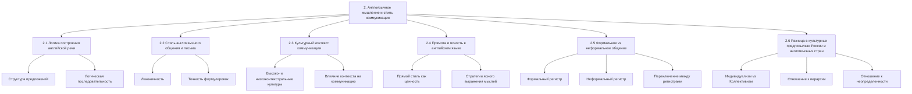

# Схема раздела 2. Англоязычное мышление и стиль коммуникации

## Статус раздела
- **Прогресс**: 6 из 6 тем готово (100%)
- **Приоритет**: Завершено
- **Следующие задачи**: 
  1. Переход к разделу 3. Структура английского предложения

## Темы раздела
- **[[2. Англоязычное мышление и стиль коммуникации|Англоязычное мышление и стиль коммуникации]]** ✅ - завершено
- **[[2.1 Логика построения английской речи|Логика построения английской речи]]** ✅ - завершено
- **[[2.2 Стиль англоязычного общения и письма|Стиль англоязычного общения и письма]]** ✅ - завершено
- **[[2.3 Культурный контекст коммуникации|Культурный контекст коммуникации]]** ✅ - завершено
- **[[2.4 Прямота и ясность в английском языке|Прямота и ясность в английском языке]]** ✅ - завершено
- **[[2.5 Формальное vs неформальное общение|Формальное vs неформальное общение]]** ✅ - завершено
- **[[2.6 Разница в культурных предпосылках России и англоязычных стран|Разница в культурных предпосылках России и англоязычных стран]]** ✅ - завершено

## Краткое описание тем

### [[2. Англоязычное мышление и стиль коммуникации|Англоязычное мышление и стиль коммуникации]]
Общий обзор фундаментальных различий между русским и английским способами мышления и коммуникации. Объясняет, как эти различия влияют на построение речи и восприятие информации.

### [[2.1 Логика построения английской речи|Логика построения английской речи]]
Анализ базовых принципов построения мыслей на английском языке, фокус на линейности, упорядоченности и иерархии информации в английском предложении.

### [[2.2 Стиль англоязычного общения и письма|Стиль англоязычного общения и письма]]
Исследование ключевых характеристик англоязычного стиля коммуникации: лаконичность, конкретика, структурированность, и как эти особенности проявляются в различных контекстах.

### [[2.3 Культурный контекст коммуникации|Культурный контекст коммуникации]]
Исследование влияния культурных особенностей на коммуникацию, понимание низко- и высококонтекстуальных культур и их отражения в языке.

### [[2.4 Прямота и ясность в английском языке|Прямота и ясность в английском языке]]
Исследование культурной ценности прямоты в англоязычной коммуникации, сравнение с более контекстуальным и имплицитным русским подходом.

### [[2.5 Формальное vs неформальное общение|Формальное vs неформальное общение]]
Анализ различий между формальным и неформальным стилями в английском языке, правила переключения между ними и типичные маркеры каждого стиля.

### [[2.6 Разница в культурных предпосылках России и англоязычных стран|Разница в культурных предпосылках России и англоязычных стран]]
Глубокий анализ исторических и культурных факторов, повлиявших на формирование различных коммуникативных стилей, и их современное проявление в деловом общении.

## Схема раздела

## Ключевые идеи раздела

Этот раздел посвящен особенностям мышления и коммуникации, характерным для англоязычной среды. Понимание этих особенностей критически важно для эффективного общения с англоязычными коллегами и партнерами.

### Что мы узнали:

1. **Логика построения речи** — английский язык следует принципу "сначала главное", требует ясной структуры предложений и логичного развития мысли.

2. **Стиль общения** — англоязычная коммуникация ценит лаконичность, ясность, прямоту и точность формулировок.

3. **Культурный контекст** — англоязычная культура относится к низкоконтекстуальным, где информация должна быть явно выражена, а не подразумеваться.

4. **Прямота и ясность** — прямое выражение мыслей ценится как проявление честности и эффективности, а не грубости.

5. **Регистры общения** — понимание разницы между формальным и неформальным стилями и умение переключаться между ними критически важно для адаптации к разным ситуациям.

6. **Культурные предпосылки** — глубинные культурные различия между российским и англоязычным мышлением влияют на восприятие информации, принятие решений и построение отношений.

## Связанные разделы
- [[1. Введение/1. Введение|Введение]] - предшествующий раздел
- [[3. Структура английского предложения/3. Структура английского предложения|Структура английского предложения]] - следующий логический раздел
- [[13. Аналогии с программированием/13. Аналогии с программированием|Аналогии с программированием]] - программистские аналогии для понимания мышления
